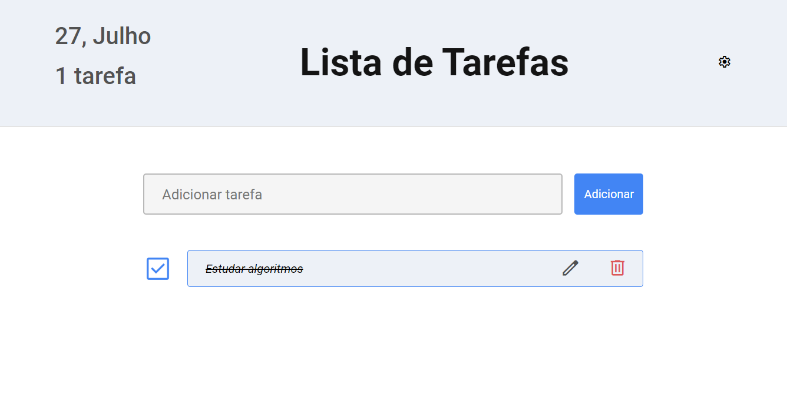

# Todo-list

Um aplicativo de lista de tarefas construído com HTML, CSS e JavaScript no frontend, e Node.js no backend, utilizando Docker Compose para gerenciamento de containers.

## Tecnologias Utilizadas

-   Frontend:
    -   HTML
    -   CSS
    -   JavaScript
-   Backend:
    -   Node.js
    -   Express.js
    -   MySQL
-   Ferramentas e Bibliotecas:
    -   Docker Compose
    -   cors
    -   dotenv
    -   mysql2
    -   eslint (com configuração Airbnb)
    -   nodemon

## Funcionalidades

### Gerenciamento de Tarefas



---

1. Criação de Nova Tarefa:

    > Permite ao usuário adicionar uma nova tarefa à lista, com inserção no banco de dados.

2. Exclusão de Tarefa:

    > Permite ao usuário excluir uma tarefa existente.

3. Marcar Tarefa como Feita:

    > Permite ao usuário marcar uma tarefa como concluída.

4. Edição de Tarefa:
    > Permite ao usuário editar o conteúdo de uma tarefa existente.

## Instalação e Uso

1. Clone o repositório

```bash
git clone https://github.com/marceloanje/todo-list.git
cd todo-list/backend
```

2. Configure o Docker Compose

```bash
docker-compose up
```

3. Inicialize o backend

Os serviços já estarão rodando após o comando docker-compose up. Verifique se o backend está acessível em `http://localhost:3000`.

4. Acesse o frontend.

Para abrir o frontend, navegue até a pasta frontend e abra o arquivo `index.html` no seu navegador.
